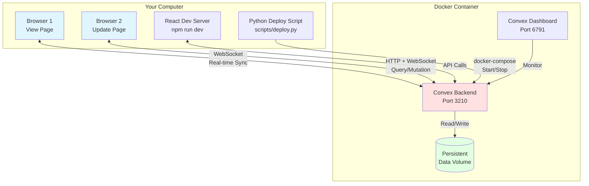
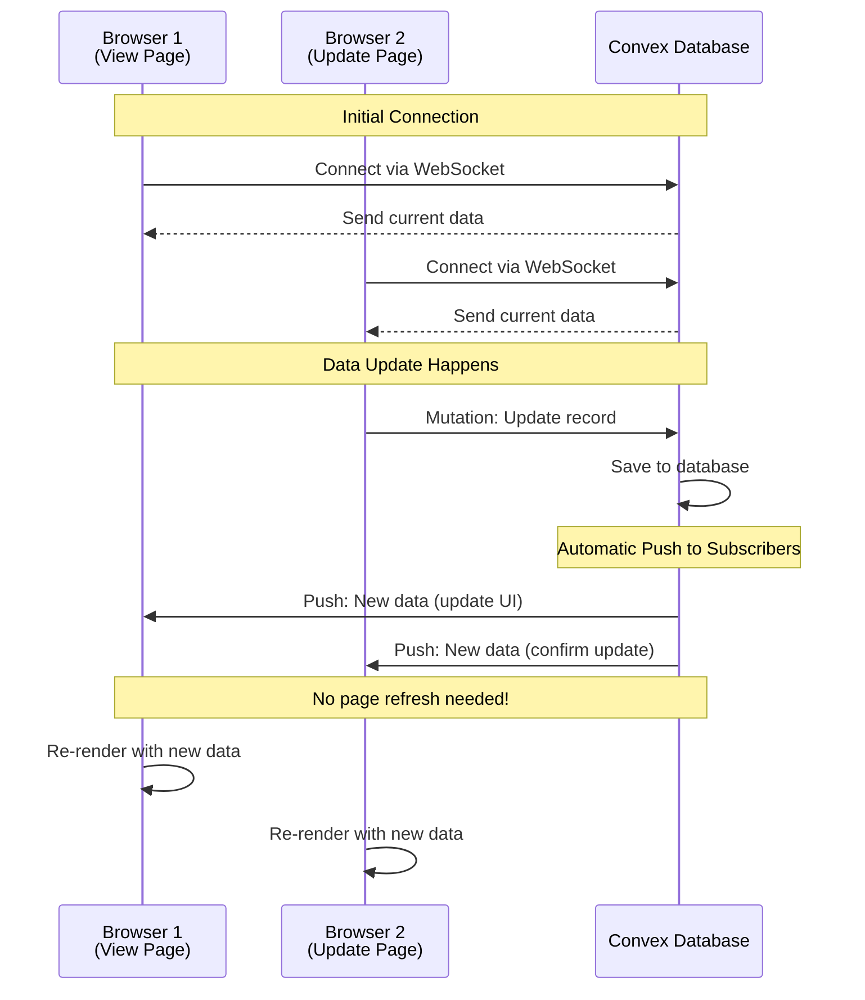
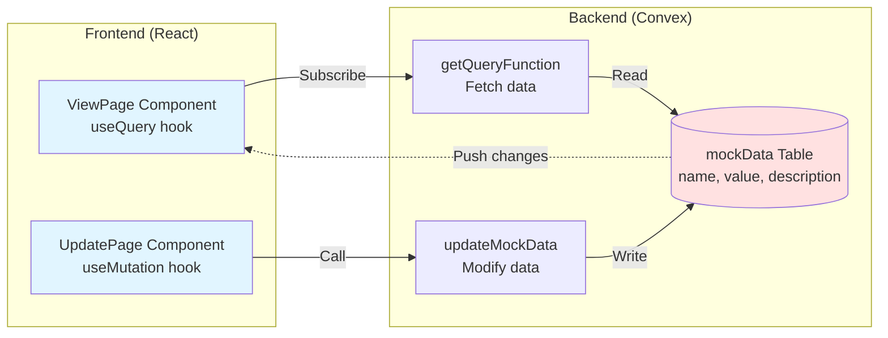
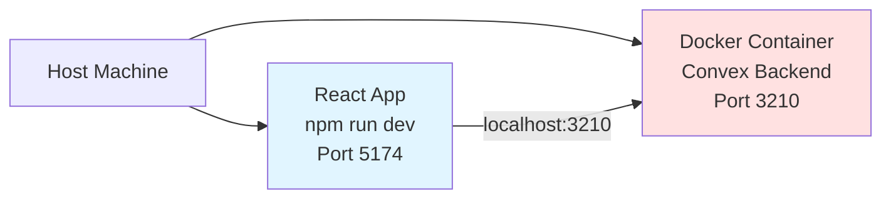
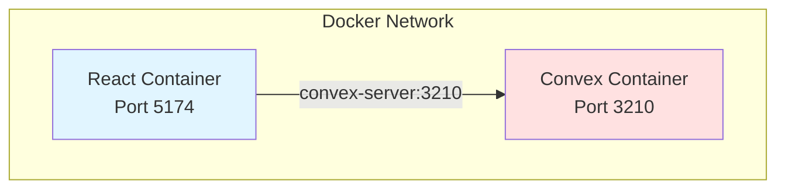

# Convex POC - Real-time React Application

A proof-of-concept application demonstrating **real-time data synchronization** using Convex self-hosted database. This application shows how multiple browsers can stay in sync automatically - when data changes in one place, all connected views update instantly without any page refresh.

## What This Project Demonstrates

Imagine you're collaborating on a shared document with a colleague. When your colleague types something, you see it appear instantly. This project demonstrates that same concept for web applications using **Convex** - a real-time database that keeps all connected clients in sync automatically.

**Key Features:**
- **Real-time sync**: Changes in one browser appear instantly in all other browsers
- **Two-page interface**: View data (read-only) and Update data (write operations)
- **Self-hosted database**: Convex runs locally in a Docker container
- **Simple deployment**: Everything starts with a single Python script

---

## Architecture Overview

### High-Level Architecture



### How Real-Time Sync Works



### Data Flow



---

## Prerequisites

Before running this project, ensure you have:

- **Node.js 18+** - JavaScript runtime for React development
- **npm** - Package manager (comes with Node.js)
- **Docker Desktop** - Container platform for running Convex
- **Python 3.8+** - For the deployment orchestration script

### Checking Prerequisites

```bash
# Check Node.js version (should be 18+)
node --version

# Check npm version
npm --version

# Check Docker Desktop is running
docker --version

# Check Python version (should be 3.8+)
python --version
```

---

## Quick Start

### Step 1: Install Dependencies

```bash
# Install frontend dependencies
npm install
```

### Step 2: Start the Convex Backend

```bash
# Start Convex server in Docker (with health check wait)
npm run deploy
# Or directly: python scripts/deploy.py up
```

This command:
1. Starts the Convex backend in a Docker container
2. Waits for the service to be healthy
3. Exposes Convex at `http://localhost:3210`

**Output:**
```
✓ Starting Convex backend...
✓ Waiting for Convex backend to be ready...
✓ Convex backend is ready!
  Backend:  http://localhost:3210
  Dashboard: http://localhost:6791
```

### Step 3: Generate Admin Key

```bash
# Generate admin key for backend operations
npm run generate-admin-key
```

Copy the generated key and add it to a `.env` file:

```bash
# Create .env file
cp .env.example .env

# Edit .env and paste your admin key
# CONVEX_ADMIN_KEY=<paste-your-key-here>
```

### Step 4: Seed Initial Data

```bash
# Populate the database with sample data
npm run seed-data
```

This adds 5 sample records (Alpha, Beta, Gamma, Delta, Epsilon) to demonstrate real-time sync.

### Step 4.5: Generate Convex Type Bindings

```bash
# Generate type-safe API bindings for React app
npx convex codegen
```

This command:
1. Reads your Convex schema and functions
2. Generates TypeScript types in `convex/_generated/`
3. Creates type-safe imports for your React app

**Output:**
```
convex/_generated/
├── api.ts         # Type-safe API exports
├── dataModel.ts   # Database schema types
└── server.ts      # Server-side types
```

> **Why is this needed?** Convex uses code generation to provide end-to-end type safety. When you import `api.functions.getMockData` in React, TypeScript knows exactly what data it returns.

### Step 5: Start the React Application

```bash
# Start the development server
npm run dev
```

Open your browser to `http://localhost:5174`

---

## Testing Real-Time Sync

1. **Open two browser windows** side by side
2. **Window 1**: Navigate to `http://localhost:5174/view` (View Page)
3. **Window 2**: Navigate to `http://localhost:5174/update` (Update Page)
4. **In Window 2**: Select a record and update its value
5. **Watch Window 1**: Changes appear instantly without refresh!

---

## Project Structure

```
convex-poc2/
├── convex/                    # Convex backend code
│   ├── schema.ts             # Database schema (data model)
│   ├── schema.test.ts        # Schema validation tests
│   ├── functions.ts          # Query and mutation functions
│   ├── functions.test.ts     # Function tests
│   └── _generated/           # Auto-generated type bindings (run npx convex codegen)
├── scripts/                   # Utility and deployment scripts
│   ├── deploy.py             # Docker Compose orchestration
│   ├── generate_admin_key.sh # Admin key generation wrapper
│   └── seed-data.sh          # Database seeding script
├── src/
│   ├── pages/                # React page components
│   │   ├── ViewPage.jsx      # Read-only data display
│   │   ├── ViewPage.test.jsx # ViewPage component tests
│   │   ├── UpdatePage.jsx    # Data update form
│   │   └── UpdatePage.test.jsx # UpdatePage component tests
│   ├── test/                 # Test configuration
│   │   └── setup.js          # Vitest setup file
│   ├── App.jsx               # Main app with routing
│   ├── main.jsx              # Entry point with ConvexProvider
│   └── App.css               # Component styles
├── docker-compose.yml        # Convex backend configuration
├── vitest.config.js          # Vitest test configuration
├── vite.config.js            # Vite build configuration
├── package.json              # Project dependencies and scripts
├── .env.example              # Environment variable template
└── README.md                 # This file
```

---

## Available Scripts

| Command | Description |
|---------|-------------|
| `npm run dev` | Start React development server (port 5174) |
| `npm run build` | Build React app for production |
| `npm run deploy` | Start Convex backend in Docker |
| `npm run generate-admin-key` | Generate Convex admin key |
| `npm run seed-data` | Populate database with sample data |
| `npm test` | Run tests in watch mode |
| `npm run test:run` | Run tests once |
| `npm run test:ui` | Run tests with UI interface |
| `npm run test:coverage` | Generate test coverage report |

### Python Deploy Script Commands

```bash
# Start services with health check
python scripts/deploy.py up

# Stop all services
python scripts/deploy.py down

# Show logs from all services
python scripts/deploy.py logs

# Show service status
python scripts/deploy.py status
```

---

## Configuration

### Environment Variables

Create a `.env` file (copy from `.env.example`):

```bash
# React Frontend - Development Mode (REQUIRED)
VITE_CONVEX_DEPLOYMENT_URL=http://localhost:3210

# Convex Backend (for admin operations)
CONVEX_ADMIN_KEY=<generated-from-script>
CONVEX_DEPLOYMENT_URL=http://localhost:3210
```

> **Important:** The React app specifically looks for `VITE_CONVEX_DEPLOYMENT_URL`. If you see connection errors, verify this exact variable name is set. Using `npx convex dev` will create a `.env.local` file with `VITE_CONVEX_URL` - you must rename it to `VITE_CONVEX_DEPLOYMENT_URL` for the React app to connect properly.

### Docker Services

The `docker-compose.yml` defines two services:

| Service | Port | Description |
|---------|------|-------------|
| **convex-server** | 3210, 3211 | Convex backend API and HTTP actions |
| **convex-dashboard** | 6791 | Web dashboard for monitoring |

---

## Key Concepts Explained

### What is Convex?

**Convex** is a full-stack platform that combines:
- A **real-time database** (like Firebase, but self-hosted)
- **Backend functions** (queries and mutations)
- **Automatic sync** via WebSocket connections

Think of it as a database that "pushes" changes to all connected clients, rather than waiting for clients to "pull" updates.

### How Does useQuery Work?

```javascript
const mockData = useQuery(api.functions.getMockData);
```

This hook does three things automatically:
1. **Fetches data** from Convex on first render
2. **Subscribes** to changes (keeps WebSocket open)
3. **Re-renders** component when data changes

No manual refresh, polling, or event listeners needed!

### How Does useMutation Work?

```javascript
const updateData = useMutation(api.functions.updateMockData);
await updateData({ id, name, value });
```

When you call a mutation:
1. Convex executes the database update
2. Convex notifies **all subscribed clients** automatically
3. All browsers using `useQuery` re-render with new data

### Why Docker for Convex?

Docker provides:
- **Isolation**: Convex runs in a separate environment
- **Persistence**: Data saved in Docker volumes survives restarts
- **Portability**: Same configuration works on any machine

---

## Development vs Production Deployment

### Development Mode (Default)



- **React app** runs directly on host (via `npm run dev`)
- **Convex backend** runs in Docker container
- **Benefit**: Fast hot-module replacement for development

### Production Mode (Fully Containerized)



- Both React and Convex run in Docker containers
- React uses `convex-server:3210` (internal service name)
- **Benefit**: Single deployment unit for production

This project focuses on **development mode** for the best developer experience.

---

## Troubleshooting

### Convex Server Not Ready

**Problem**: Connection errors when starting React app

**Solution**:
```bash
# Check if Convex is running
docker ps | grep convex

# Check Convex logs
docker logs convex-backend

# Restart services
python scripts/deploy.py down
python scripts/deploy.py up
```

### Admin Key Issues

**Problem**: `CONVEX_ADMIN_KEY` not found or invalid

**Solution**:
```bash
# Generate a new key
npm run generate-admin-key

# Verify it's in .env
cat .env | grep CONVEX_ADMIN_KEY
```

### Data Not Seeding

**Problem**: `npm run seed-data` fails

**Solution**:
1. Verify `.env` file exists and contains `CONVEX_ADMIN_KEY`
2. Check Convex container is running: `docker ps`
3. Check container logs: `docker logs convex-backend`

### Port Already in Use

**Problem**: Ports 3210, 5174, or 6791 already occupied

**Solution**:
```bash
# Check what's using the port
lsof -i :3210  # or 5174 or 6791

# Stop the conflicting service or change ports in docker-compose.yml
```

### App Shows No Data / Connection Errors

**Problem**: App loads but displays empty data list or shows connection errors in browser console

**Root Cause**: Missing or incorrect environment variable name

**Solution**:
```bash
# 1. Check your .env or .env.local file
cat .env.local | grep VITE_CONVEX

# 2. Verify the exact variable name is VITE_CONVEX_DEPLOYMENT_URL
# If you see VITE_CONVEX_URL instead, add the correct name:

echo 'VITE_CONVEX_DEPLOYMENT_URL=http://127.0.0.1:3212' >> .env.local

# 3. Restart the Vite dev server
# Ctrl+C to stop, then: npm run dev
```

> **Why this happens**: `npx convex dev` creates `.env.local` with `VITE_CONVEX_URL`, but the React app is configured to use `VITE_CONVEX_DEPLOYMENT_URL`. Both variables should point to the same Convex backend URL.

### 404 Error for /convex/_generated/api.js

**Problem**: Browser console shows `net::ERR_ABORTED 404 (Not Found)` for `http://localhost:5174/convex/_generated/api.js`

**Root Cause**: Vite proxy configuration is too broad, intercepting local file requests and forwarding them to the backend.

**Solution**: Check your `vite.config.js` proxy configuration:

```javascript
// INCORRECT - Too broad!
proxy: {
  '/convex': {  // ← This catches ALL /convex paths
    target: 'http://localhost:3210',
    changeOrigin: true,
    ws: true,
  }
}

// CORRECT - Only proxy API calls
proxy: {
  '/convex/api': {  // ← Only proxy API endpoint
    target: 'http://localhost:3210',
    changeOrigin: true,
    ws: true,
    rewrite: (path) => path.replace(/^\/convex\/api/, '/api'),
  }
}
```

> **Why this happens**: The `convex/_generated/api.js` file is a **local file** that should be resolved by Vite's module resolution from the filesystem. The proxy should only forward API calls (`/convex/api/*`) to the Convex backend, not local module requests.

**Verification**:
```bash
# After fixing and restarting, verify the file is accessible
curl http://localhost:5174/convex/_generated/api.js
# Should return 200 OK with JavaScript content
```

---

## Monitoring and Debugging

### Convex Dashboard

Access the Convex dashboard at `http://localhost:6791` to:
- View database contents
- Monitor query performance
- Inspect WebSocket connections
- View function logs

### Browser DevTools

Open browser DevTools (F12) to see:
- **Network tab**: WebSocket connections to Convex
- **Console tab**: Any errors or warnings
- **React DevTools**: Component state and props

### Docker Logs

```bash
# Follow Convex logs in real-time
docker logs -f convex-backend

# See recent logs
docker logs --tail 50 convex-backend
```

---

## Cleaning Up

### Stop Services

```bash
# Stop all Docker containers
python scripts/deploy.py down
# Or: docker-compose down

# Remove Docker volumes (deletes all data)
docker volume rm convex-poc-data
```

### Remove Generated Files

```bash
# Remove Convex generated files
rm -rf convex/_generated

# Remove .env file (if you want to reset config)
rm .env
```

---

## Learn More

### Official Documentation
- [Convex Documentation](https://docs.convex.dev/home) - Complete guide to Convex features
- [Convex Self-Hosted](https://github.com/get-convex/convex-backend/blob/main/self-hosted/README.md) - Self-hosting guide
- [React Documentation](https://react.dev/) - React framework docs
- [Vite Guide](https://vitejs.dev/guide/) - Build tool documentation

### Key Concepts to Explore
- **Convex Functions**: Queries (reads), Mutations (writes), Actions (complex operations)
- **Convex Schema**: Type-safe data modeling with validation
- **Real-time Subscriptions**: How WebSocket sync works under the hood
- **Docker Volumes**: Persistent data storage for containers

---

## License

MIT License - Feel free to use this POC as a starting point for your own projects!

---

## Summary

This project demonstrates the power of **real-time web applications** using Convex:

1. **Simple architecture**: React frontend + Convex backend
2. **Automatic sync**: No manual refresh or polling needed
3. **Self-hosted**: Complete control over your data
4. **Easy deployment**: Single command to start everything

Open two browsers, update data in one, watch it appear in the other - instantly! 🚀
