# Root Cause Analysis (RCA)
## App Unable to View Data - January 15, 2026

---

## Executive Summary

**Issue:** The web application's "View" page was not displaying any data from the database.

**Impact:** Users could open the application but saw an empty list instead of the expected data records.

**Root Cause:** A missing configuration setting (environment variable) that tells the web application how to connect to the database.

**Resolution:** Added the missing configuration value and restarted the web server.

**Time to Resolution:** Approximately 10 minutes

---

## What Happened? (Timeline)


---

## The Problem Explained Simply

Think of your web application like a **restaurant**:

- **Frontend (Web Page)** = The dining room where customers sit
- **Backend (Database)** = The kitchen where food is prepared
- **Environment Variables** = The phone number that connects waiters to the kitchen

**The Issue:** The dining room was open, the kitchen was cooking, but the waiters didn't have the correct phone number to call the kitchen. So when customers asked for the menu (data), the waiters couldn't get it from the kitchen.

---

## Technical Details (Simplified)

### System Architecture


### What Was Wrong

| What We Needed | What We Had | Status |
|----------------|-------------|--------|
| `VITE_CONVEX_DEPLOYMENT_URL` | `VITE_CONVEX_URL` | ❌ Name mismatch |
| Value: `http://127.0.0.1:3212` | Value: `http://127.0.0.1:3212` | ✓ Value was correct |

**The Fix:** Added a line to `.env.local`:
```
VITE_CONVEX_DEPLOYMENT_URL=http://127.0.0.1:3212
```

---

## Root Cause Analysis

### Five Whys (A Problem-Solving Method)


### Classification

| Category | Answer |
|----------|--------|
| **Type** | Configuration Error |
| **Origin** | Environment Variable Naming |
| **Human Factor** | Automated setup used different naming convention than application code expected |
| **Detection** | Manual testing and code inspection |

---

## Data Flow (After Fix)

```mermaid
sequenceDiagram
    participant User as 👤 User Browser
    participant Vite as 🌐 Vite Server
    participant React as ⚛️ React App
    participant Convex as 🗄️ Convex Database

    User->>Vite: Request localhost:5174/view
    Vite->>React: Load ViewPage component
    React->>React: Read VITE_CONVEX_DEPLOYMENT_URL
    Note over React: ✅ Now has correct URL!
    React->>Convex: Query getMockData()
    Convex->>Convex: Fetch from mockData table
    Convex-->>React: Return 2 records
    React-->>User: Display data on screen
```



---

## Lessons Learned

### What Went Well
✓ Quick identification of the missing backend service
✓ Systematic checking of each component
✓ Used command-line tools to verify services

### What Could Be Improved
📝 **Add startup validation:** The app could check for required config on startup
📝 **Better documentation:** Clear naming conventions for environment variables
📝 **Pre-flight checklist:** Verify all services and config before testing

### Preventive Measures

| Action | Owner | Priority |
|--------|-------|----------|
| Document all required environment variables in README | Developer | High |
| Add config validation to app startup | Developer | Medium |
| Create startup script that verifies all services | DevOps | Low |

---

## Verification Steps (How We Know It's Fixed)

1. ✓ Backend server running on port 3212
2. ✓ Frontend server running on port 5174
3. ✓ Environment variable correctly set
4. ✓ Database contains test data (2 records)
5. ✓ Application can successfully query and display data

---

## Glossary

| Term | Simple Explanation |
|------|-------------------|
| **Backend** | The part of the application that stores and processes data (like the kitchen) |
| **Frontend** | The part of the application users see and interact with (like the dining room) |
| **Environment Variable** | A setting stored in a file that configures how the application runs |
| **Port** | Like a door number - helps different services communicate without confusion |
| **Vite** | A tool that runs the web application during development |
| **Convex** | The database service that stores and retrieves the application's data |

---

**Report Generated:** January 15, 2026
**Author:** Claude Code Assistant
**Status:** ✅ RESOLVED
